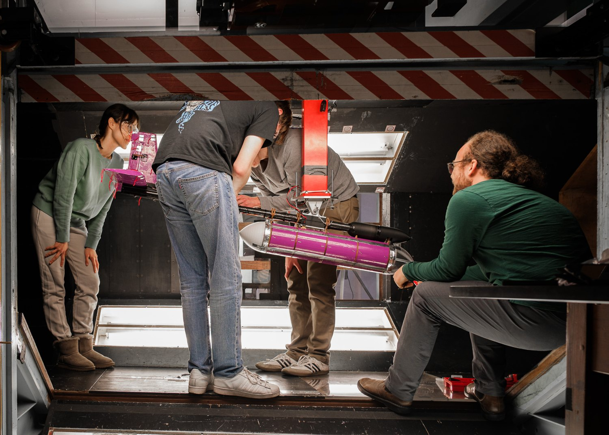
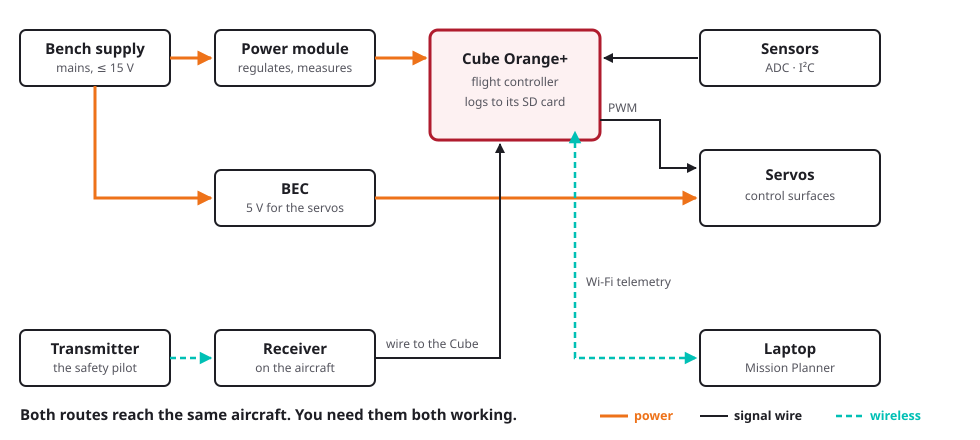
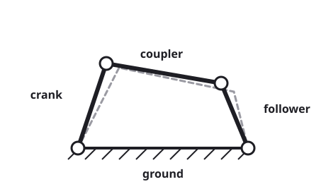
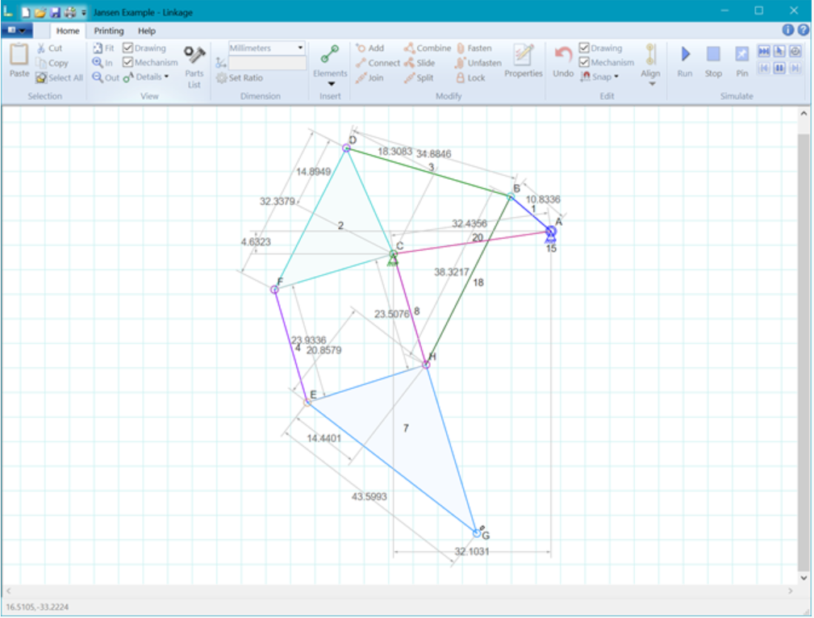
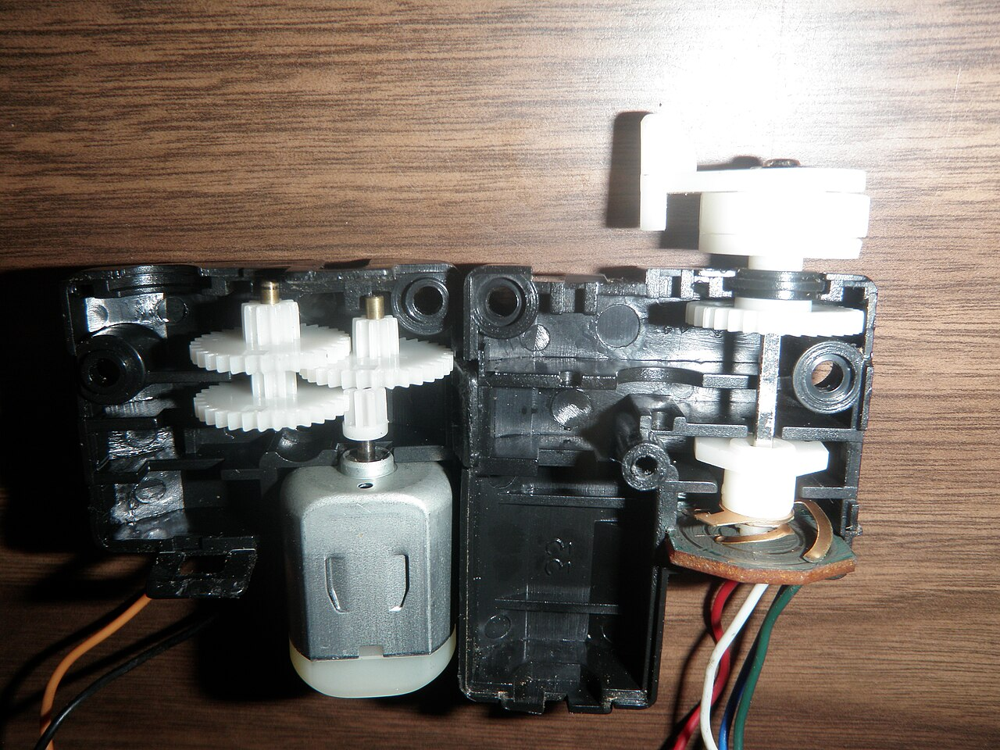
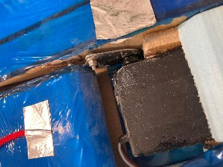
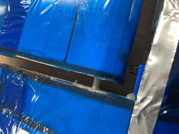

# Introduction

The introductory lecture for **Avionics and Mechanisms**, delivered to the full cohort. Session times and rooms are on the unit SharePoint.

[Slides](../slides/intro/index.html)
[Slides (PDF)](../slides/intro/slides.pdf)

This page carries the same material as the lecture, so you can read it back afterwards rather than working from the slides alone.

## Who's who

| | Strand |
|---|---|
| **Dr Steve Bullock** | Avionics, Mechanisms |
| **George Burns** | Avionics |
| **Tim Ward** | Avionics |
| **Robin Carter** | Avionics |
| **Mark Graham** | Mechanisms |
| **Vince Maes** | Mechanisms |

Rooms, and what happens in each, are on the [Getting ready](getting-ready.md) page.

## Part 1 — Avionics

### The model is only as good as what moves it

{ width="640" }

*Last year's fuselage in the 7×5 tunnel. Photo: Ross Dewar.*

* Your model has **control surfaces**, and something has to move them repeatably.
* Your test campaign needs **data** — measured, time-stamped, logged.
* Your aerodynamicists need **the angle you asked for**, not the one you got.
* Avionics and mechanisms are what turn foam and carbon into an **instrumented test article**.

### Flight-grade kit, off-design

The Cube Orange+ runs ArduPilot and is the Flight Lab's standard research autopilot. It flies for volcano monitoring, conservation and search and rescue — [here it is doing the first of those](https://www.youtube.com/watch?v=N57M-9iFxZ8&t=23s).

In AVDASI 2 you bolt that same autopilot into a wind tunnel, with no GPS, and command surfaces directly. That is deliberately off-design: much of the avionics work in this unit is getting a flight controller to behave usefully on the ground.

### What the specification asks of avionics

!!! quote "Requirements specification, §2.2"

    "Aircraft control systems **shall** comprise a flight control system (FCS), radio control system (RCS), telemetry system (TMS), and ground control station (GCS), with associated power, wiring harnesses, antennae etc."

**Provided to you**

* The flight controller
* The radio control system
* The telemetry system
* Servos, from a set list

**Yours to design**

* Power distribution and harnesses
* Mounting and installation
* Logging, calibration, evidence
* Everything that connects them

That word *shall* matters: this is a customer document, not advice. Almost none of the hardware is a choice, and almost all of the engineering is in what joins it together.

### What it has to do

* Every surface — elevator, rudder, aileron, flap — **commandable from both the radio and the telemetry link**, to specific angles.
* **PID stability augmentation** in pitch, tuned on the provided flight controller, switchable on and off.
* **Log flight data: 5 Hz minimum, 20 Hz preferred** — pitch angle and rate, servo demand, and whatever else your Company needs.
* Everything **removable**, fixed with mechanical fasteners, for maintenance and recycling.
* **Nothing above 15 V**, anywhere on or connected to the aircraft.

The logging rate is the one most groups underestimate. It rules out the slow-and-simple approaches, so decide early how you are going to meet it.

### What "done" looks like — for now

!!! quote "Requirements specification, §2.2"

    "A bench-top prototype of full FCS, RCS, TMS, GCS, and associated systems **shall be demonstrated working** at Gate 2a."

* The [step-by-step guide](stepbystep/index.md) takes you there: kit, autopilot, telemetry, power, servos, sensors, logging.
* Mechanism prototypes are demonstrated with **servo testers**, not the flight controller.
* **This is what done means for this teaching block only — integration comes next.** A bench that works is not an aircraft that works.

This teaching block ends with two halves that each work on a bench. Putting them together is the harder job, it starts in TB2, and it is the thing groups leave too late.

### Avionics depends on integration

| With | You need to agree |
|---|---|
| **Aerodynamics** | Surface sizes and deflections, and so hinge moments, and so servo torque |
| **Mechanisms** | Where the boundary sits: they own torque, servo choice and kinematics; **you supply the PWM** |
| **Structures** | Mounting, access, cable routes, mass |
| **Test** | Power, comms, what's logged, how it's handed over |

Avionics is not only an integration job, but it depends on integration more than most. That table is a **starting point, not the answer** — read the specification for your own remit, then agree each interface with the division opposite. Interfaces agreed late are the ones that fail.

### Interfaces to pin down early

* **Torque and travel**: what the surface needs, and what the servo gives with margin when it is stalled.
* **Power**: what each component draws, at what voltage, from which supply.
* **Connectors and cables**: which plug, which route, and who crimps it.
* **Data**: what's logged, at what rate, in what units, and who uses it.
* **Command**: who moves which surface in the tunnel, and how you stop it.

Most of these depend on other teams' work that hasn't happened yet. Start with a rough number — theirs, or your own gut — and track what has to be firmed up, and by when. **This list is not exhaustive**; yours will be longer.

!!! warning "Servo stall is not aerodynamic stall"

    A stalled servo is one driving against a stop or a jam, drawing its maximum current — amps, from a rail you may have sized for milliamps. It has nothing to do with the wing stalling, and the double meaning catches people every year.

### The system on the bench

{ width="780" }

Both routes — the radio link and the telemetry link — reach the same aircraft, and you need them both working.

### Workshops, and your first Friday

Avionics workshops run on Friday mornings in the Stack Room, starting in week 1 with kit issue. The full schedule is on the unit SharePoint.

Week 1 runs like this:

1. A short taught introduction in the Stack Room: the kit, and the requirements in more depth.
2. Groups go up to the avionics lab, one at a time, to collect a kit.
3. While you wait, read the guide's first pages — [Kit](stepbystep/00-kit.md) and [Cube](stepbystep/01-cube.md) — which need no hardware.
4. With kit in hand, work through the guide to the checkpoint.
5. To finish: how not to break each component.

**The checkpoint for that first session:** Cube on Plane firmware, buzzer quiet, connected over Wi-Fi, running on bench power.

!!! info "The Cube guidance is being revised"

    The Cube setup, scripts and guidance are being updated as of September 2026. A more robust version is coming, including a one-step settings file, so check back rather than working from a downloaded copy.

### Before your first workshop

Everything the avionics side asks of you beforehand — the Windows laptop, Mission Planner, the pages to read ahead, and what happens at kit issue — is on one page.

[Getting ready :material-arrow-right:](getting-ready.md){: .md-button .md-button--primary }

## Part 2 — Mechanisms

### What mechanisms have to deliver

{ width="560" }

*DRG A2, from the requirements specification.*

Every moving surface needs a mechanism designed, built and proved:

* **Flap** — plain, slotted or Fowler, 0° to 30°
* **Aileron**, **elevator**, **rudder** — four-bar linkages, ±40° to ±45°
* **Leading edge device** — droop or slat, starboard wing
* **Landing gear** — deployable, behind a door

Each one has to hold its angle **under aerodynamic load**, to a stated tolerance, within a stated time: 2° for elevator and rudder, 5° for flap and aileron.

### The design task

{ width="420" }

*The parts of a four-bar linkage.*

* **Kinematics**: four-bar linkages, mobility, function generation.
* Drawn and checked in the **Linkage app** — [download it](https://blog.rectorsquid.com/linkage-mechanism-designer-and-simulator/) before week 3. It is **Windows only**; the macOS version is in early beta.
* **Then the real world**: bearings, slop, backlash, friction.
* Materials, failure modes, and taking it apart again.

{ width="600" }

*A flap mechanism drawn and simulated in the Linkage app.*

### Where mechanisms meets avionics

{ width="400" }

*Inside a servo: motor, gear train, board — and a potentiometer reading the output shaft.*

* **The boundary is the servo cable.**
* **Mechanisms own** torque, servo selection, kinematics — and sensor integration.
* **Avionics own** the PWM, servo rail power, commanding angles, and logging.
* **Sensor selection is joint**: a sensor has to be readable as well as mountable.

A hobby servo is itself electromechanical, with its own closed loop inside. The potentiometer on the output shaft is compared against the commanded pulse width, and the board drives the motor until the error is zero. So the real interface arguably sits *inside* the servo, and the cable is just where we have agreed to draw the line. Every interface is a choice like that one.

Mechanism prototypes are proved on a **servo tester** before they go anywhere near the flight controller.

### Learn from what broke last year

-   

    Actuator cable-tied **and glued** to the false rear spar

-   

    Weak linkages, **no washers**, nothing to reduce friction

-   

    **Threaded rod** as a pivot, into an oversize hole and into the foam

Start simple, prototype early, and design for disassembly.

### Design realisation

The mechanisms sessions work through, in order:

* **From kinematics to practical geometry** — turning a linkage that works on paper into one that can be made.
* **Transferring torque and motion** — including what happens when a surface is carried at each end and driven from only one.
* **Design of pivots and joints.**
* **Standard parts and their uses** — bearings, bushes, washers, shoulder screws.
* **Precision machining and metrology.**
* **Functional tolerancing and tolerance analysis.**
* **Examples and non-examples**, from previous years' aircraft.

Sessions run on Thursdays in the Design Suite from week 3; the schedule is on SharePoint, and the room is linked from [Getting ready](getting-ready.md).

## Credits

Wind tunnel photographs by Ross Dewar. Servo internals by Jstapko, [CC BY-SA 3.0](https://creativecommons.org/licenses/by-sa/3.0/), via Wikimedia Commons. The general arrangement drawing is from the unit requirements specification; the mechanisms material is Mark Graham's.
